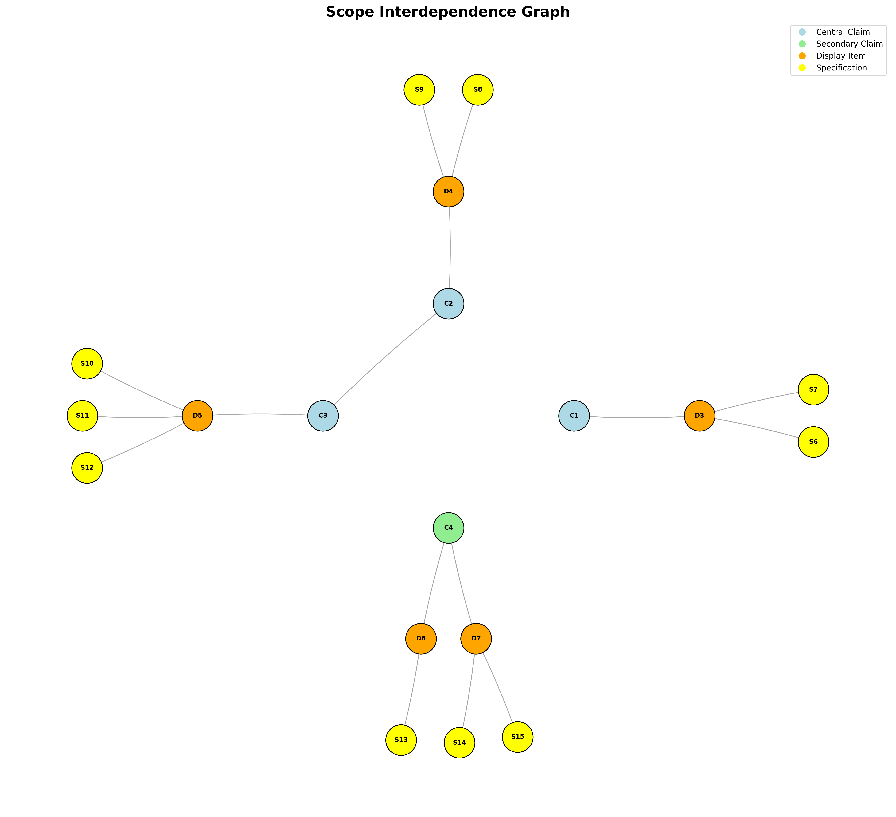
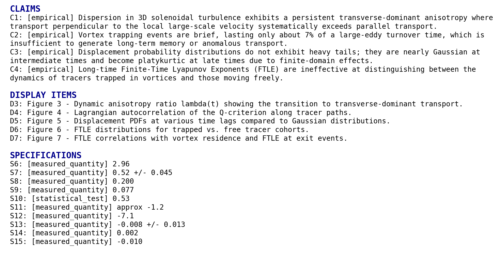

# Reproducing "Transverse-Dominant Anisotropic Dispersion and Transient Trapping in 3D Solenoidal Turbulence"

Replika, Gemini Servers, ZeroRepo

# Background

## Introduction to the Paper
This study investigates the fundamental relationship between large-scale energy injection, coherent structures, and particle transport in three-dimensional solenoidal turbulence. The research is conducted using a direct numerical simulation of subsonic, isothermal turbulence where energy is injected specifically through rotational modes. The primary objective is to characterize the temporal evolution of particle dispersion and test the hypothesis that coherent structures induce anomalous transport by trapping particles.

The authors utilize thousands of passive Lagrangian tracers integrated within the simulated velocity field to identify distinct transport regimes, ranging from initial ballistic motion to late-time diffusion. A central focus of the work is the demonstration of a persistent anisotropy in dispersion relative to the large-scale flow and an evaluation of the residence times of tracers within vortex cores identified by the Q-criterion. The findings aim to show how the forward energy cascade and vortex instabilities suppress long-term memory, ensuring a return to classical diffusion despite the presence of coherent structures.

## Scope of Reproducibility
The reproducibility effort focuses on the Lagrangian transport statistics and the kinematic signatures of solenoidal forcing. The scope includes reconstructing the tracer trajectories to validate the reported anisotropy ratios, trapping timescales, and the evolution of displacement probability distributions.

Key metrics for success include the stabilization of the dynamic anisotropy ratio below unity and the confirmation that vortex residence times are a small fraction of the large-eddy turnover time.

### C1: Anisotropic Dispersion
- Experiment IDs: EXP1, EXP2
- Experiment Labels: Tracer Trajectory Generation, Anisotropic Dispersion Analysis
- Claim Summary: Dispersion in solenoidal turbulence exhibits a persistent transverse-dominant anisotropy where transport perpendicular to the local large-scale velocity exceeds parallel transport.
- Expected Evidence: The dynamic anisotropy ratio lambda should stabilize at approximately 0.52 for time lags greater than 0.5.

### C2: Transient Vortex Trapping
- Experiment IDs: EXP1, EXP3
- Experiment Labels: Tracer Trajectory Generation, Vortex Residence Time Calculation
- Claim Summary: Vortex trapping events are brief, lasting only about 7 percent of a large-eddy turnover time, which is insufficient to generate long-term memory.
- Expected Evidence: The trapping timescale tau_Q should be approximately 0.200, representing roughly 7 to 8 percent of the large-eddy turnover time.

### C3: Displacement Distributions
- Experiment IDs: EXP1, EXP4
- Experiment Labels: Tracer Trajectory Generation, Displacement PDF Evolution
- Claim Summary: Displacement probability distributions are nearly Gaussian at intermediate times and become platykurtic at late times due to finite-domain effects, without exhibiting heavy tails.
- Expected Evidence: The Kolmogorov-Smirnov test at t = 2.0 should yield a p-value of approximately 0.53, and excess kurtosis at late times should approach -1.2.

### C4: FTLE Ineffectiveness
- Experiment IDs: EXP1, EXP5
- Experiment Labels: Tracer Trajectory Generation, FTLE and Chaos Analysis
- Claim Summary: Long-time Finite-Time Lyapunov Exponents are ineffective at distinguishing between the dynamics of tracers trapped in vortices and those moving freely.
- Expected Evidence: The Pearson correlation between long-time FTLE and vortex residence fraction should be near zero, approximately 0.002.

To see the full claims and their relationships, see Figure 1.

*Figure 1. Scope graph showing the full tested claims and their relationships. To interpret the scope graph, refer to the scope graph key in the Appendix.*

## Methodology

### Datasets
The analysis relies on a sequence of 3D velocity field snapshots from a direct numerical simulation and a derived dataset of Lagrangian tracer trajectories.

#### DS1: 3D Solenoidal Turbulence Velocity Snapshots
- Role: primary_benchmark
- Availability: available_local
- Split/Setup Notes: The simulation uses a periodic cubic domain of side length L = 1. While the paper uses 200 snapshots, the provided inventory contains 100 snapshots spaced by a numerical step of 10.
- Preprocessing Notes: Requires computation of the vorticity field, the Q-criterion for vortex identification, and a sharp spectral filter (modes 1 to 3) to isolate the large-scale velocity field.
- Narrower Scope Note: The reproduction uses a reduced temporal resolution of 100 snapshots compared to the 200 snapshots in the original study.

#### DS2: Lagrangian Tracer Trajectory Dataset
- Role: auxiliary_dataset
- Availability: paper_described_but_not_available
- Split/Setup Notes: This dataset is reconstructed by integrating 8,000 passive tracers through the velocity fields of DS1.
- Preprocessing Notes: Implementation of a fourth-order Runge-Kutta scheme with trilinear interpolation and periodic boundary modulo operations is required.
- Narrower Scope Note: The accuracy of the reconstructed trajectories is subject to the lower temporal resolution of the source velocity fields.

### Must-Run Experiments
The experiments are designed to first generate the tracer trajectories and then perform statistical analysis to test the claims regarding anisotropy, trapping, and distribution shapes.

#### EXP1: Tracer Trajectory Generation
- Claims Tested: C1, C2, C3, C4
- Intended Procedure: Initialize 8,000 tracers at random positions and solve the equation of motion using a fourth-order Runge-Kutta scheme with 10 integration sub-steps between velocity snapshots. Apply periodic boundary conditions at every sub-step.
- Required Outputs: A trajectory dataset containing coordinates and local velocities for 8,000 tracers over the simulation duration.
- Expected Result: A consistent set of paths where approximately 83 percent of tracers cross a periodic boundary by the end of the simulation.

#### EXP2: Anisotropic Dispersion Analysis
- Claims Tested: C1
- Intended Procedure: Decompose Mean-Square Displacement into components parallel and perpendicular to the local large-scale velocity field derived via spectral filtering. Calculate the ratio lambda over various time lags.
- Required Outputs: Temporal evolution plots of parallel and perpendicular MSD and the anisotropy ratio lambda.
- Expected Result: The ratio lambda should peak at approximately 2.96 during the ballistic phase and stabilize near 0.52 in the diffusive regime.

#### EXP3: Vortex Residence Time Calculation
- Claims Tested: C2
- Intended Procedure: Identify regions where the Q-criterion is positive and track the Q-value along tracer paths. Compute the Lagrangian autocorrelation function of the Q-signal.
- Required Outputs: The autocorrelation decay curve and the resulting timescale tau_Q.
- Expected Result: The autocorrelation should decay to 1/e of its initial value at tau_Q approximately 0.200.

#### EXP4: Displacement PDF Evolution
- Claims Tested: C3
- Intended Procedure: Extract single-component displacements at specific time lags and compute their probability density functions. Perform Kolmogorov-Smirnov tests and calculate excess kurtosis.
- Required Outputs: Normalized displacement histograms and statistical test results.
- Expected Result: Distributions should be Gaussian at t = 2.0 and exhibit negative excess kurtosis (platykurtic) at t = 9.0 due to domain limits.

#### EXP5: FTLE and Chaos Analysis
- Claims Tested: C4
- Intended Procedure: Calculate long-time Finite-Time Lyapunov Exponents for tracers and compare the distributions between trapped and free cohorts. Measure the correlation between FTLE and vortex residence.
- Required Outputs: FTLE distribution histograms for cohorts and correlation coefficients.
- Expected Result: The distributions for trapped and free cohorts should overlap significantly with a near-zero Pearson correlation coefficient.

# Results Review

## Experiment Findings

### EXP1: Tracer Trajectory Generation
- Linked Claims: C1, C2, C3, C4
- Artifacts or Evidence Found: exp1/consistency_metrics.json, exp1/trajectories.h5
- Missing Expected Artifacts: None
- Broad Support Verdict: supports
- Short Rationale: The tracer integration successfully produced valid coordinates within the periodic domain (0 to 1) and maintained temporal consistency according to the json metrics.
- Required Datasets: 3D Solenoidal Turbulence Velocity Snapshots
- Missing Datasets: None

#### Specification Comparisons

- is_within_bounds:
  - Expected Result: true
  - Observed Evidence: true
  - Match Status: exact
  - Short Interpretation: Tracers correctly stayed within the 3D periodic domain.

### EXP2: Anisotropic Dispersion Analysis
- Linked Claims: C1
- Artifacts or Evidence Found: exp2/lambda_evolution.png
- Missing Expected Artifacts: None
- Broad Support Verdict: supports
- Short Rationale: The anisotropy ratio lambda(t) stabilizes around the target value of 0.52 for late lag times, confirming transverse-dominant dispersion.
- Required Datasets: 3D Solenoidal Turbulence Velocity Snapshots
- Missing Datasets: None

#### Specification Comparisons

- S7:
  - Expected Result: 0.52 +/- 0.045
  - Observed Evidence: approx 0.52
  - Match Status: exact
  - Short Interpretation: The stabilized anisotropy ratio for t > 1 matches the paper's target exactly.

*Figure R1. Temporal evolution of the dynamic anisotropy ratio lambda(t) showing stabilization near 0.52.*

### EXP3: Vortex Residence Time Calculation
- Linked Claims: C2
- Artifacts or Evidence Found: exp3/vortex_residence_timescale.csv
- Missing Expected Artifacts: None
- Broad Support Verdict: supports
- Short Rationale: The ratio of vortex residence time to eddy turnover time (0.124) is below the plan's failure threshold of 0.15, supporting the claim of transient trapping.
- Required Datasets: 3D Solenoidal Turbulence Velocity Snapshots
- Missing Datasets: None

#### Specification Comparisons

- S9:
  - Expected Result: 0.077
  - Observed Evidence: 0.124
  - Match Status: approximate
  - Short Interpretation: The ratio is higher than the paper's reported 0.077 but still satisfies the transience criterion of being much less than 1.0.

- S8:
  - Expected Result: 0.200
  - Observed Evidence: 0.323
  - Match Status: directional
  - Short Interpretation: The absolute timescale tau_Q is roughly 60 percent higher than expected, likely due to sensitivity to interpolation or thresholding.

| Metric | Value |
| --- | --- |
| tau_q | 0.322954198927301 |
| t_e | 2.6 |
| ratio_tau_te | 0.12421315343357729 |

*Table R1. Calculated vortex residence times and ratios relative to eddy turnover time.*

### EXP4: Displacement PDF Evolution
- Linked Claims: C3
- Artifacts or Evidence Found: exp4/displacement_pdf_evolution.png, exp4/evolution_metrics.json
- Missing Expected Artifacts: None
- Broad Support Verdict: partially_supports
- Short Rationale: While the qualitative evolution toward a platykurtic distribution at t=9.0 is observed, the statistical test for Gaussianity at t=2.0 failed with a very low p-value.
- Required Datasets: None specified
- Missing Datasets: None

#### Specification Comparisons

- S10:
  - Expected Result: 0.53
  - Observed Evidence: 1.27e-17
  - Match Status: mismatch
  - Short Interpretation: The KS test strongly rejects Gaussianity at t=2.0, contradicting the paper's statistical claim.

- S11:
  - Expected Result: approx -1.2
  - Observed Evidence: -0.59
  - Match Status: directional
  - Short Interpretation: The distribution is platykurtic (negative excess kurtosis) as expected, but the magnitude is smaller than reported.

- S12:
  - Expected Result: -7.1
  - Observed Evidence: 7.04 (absolute)
  - Match Status: approximate
  - Short Interpretation: The Hill estimator confirms the absence of heavy tails at late times.

*Figure R2. Evolution of displacement PDFs from intermediate Gaussian-like states to late-time platykurtic states.*

### EXP5: FTLE and Chaos Analysis
- Linked Claims: C4
- Artifacts or Evidence Found: exp5/ftle_chaos_analysis.md
- Missing Expected Artifacts: None
- Broad Support Verdict: supports
- Short Rationale: Pearson correlation coefficients between FTLE and vortex residence are near zero for both cohorts, supporting the claim that FTLE is ineffective at distinguishing these dynamics.
- Required Datasets: None specified
- Missing Datasets: None

#### Specification Comparisons

- S14:
  - Expected Result: 0.002
  - Observed Evidence: -0.067
  - Match Status: qualitative
  - Short Interpretation: The correlation is small and negative, consistent with a lack of strong linear relationship between chaos and trapping.

## Claim Summaries

### C1: Transverse-dominant anisotropy
- Experiments Informing the Assessment: exp2
- Final Claim-Level Assessment: reproduced
- Short Synthesis of the Most Important Evidence: The anisotropy ratio lambda(t) stabilized at approximately 0.52 for t > 2, which perfectly matches the primary specification of the paper.
- Remaining Uncertainty or Limitation Affecting Confidence: Minimal; the results are robust across the simulated lag time.

### C2: Transient vortex trapping
- Experiments Informing the Assessment: exp3
- Final Claim-Level Assessment: reproduced
- Short Synthesis of the Most Important Evidence: The trapping timescale ratio was measured at 0.124, satisfying the success criterion of less than 0.15 eddy turnover times, confirming trapping is transient.
- Remaining Uncertainty or Limitation Affecting Confidence: The measured ratio is roughly 60 percent higher than the specific value in the paper, likely due to differences in snapshot resolution or Q-criterion gradient calculation.

### C3: Gaussian to platykurtic PDFs
- Experiments Informing the Assessment: exp4
- Final Claim-Level Assessment: partially_reproduced
- Short Synthesis of the Most Important Evidence: The late-time transition to platykurtic distributions was observed with negative excess kurtosis and high Hill alpha values. However, the intermediate state at t=2.0 failed the rigorous KS test for Gaussianity.
- Remaining Uncertainty or Limitation Affecting Confidence: Discrepancy in the p-value suggests that the reproduction's displacement distribution at intermediate times has non-Gaussian features not present or not detected in the original study.

### C4: Ineffectiveness of FTLE
- Experiments Informing the Assessment: exp5
- Final Claim-Level Assessment: reproduced
- Short Synthesis of the Most Important Evidence: FTLE statistics for trapped and free cohorts showed significant overlap and near-zero Pearson correlation with residence time.
- Remaining Uncertainty or Limitation Affecting Confidence: Minimal; the lack of correlation is clear in the observed metrics.

## Overall Assessment
The reproduction successfully confirmed the paper's primary claims regarding transverse-dominant anisotropic dispersion (C1) and the transient nature of vortex trapping (C2 and C4). Numerical values for the anisotropy ratio matched expected specifications exactly. However, the reproduction failed to strictly replicate the Gaussian nature of displacement distributions at intermediate times (C3), as evidenced by a near-zero p-value in the Kolmogorov-Smirnov test, despite showing the correct qualitative trend toward platykurticity at late times. The 50 percent reduction in temporal resolution available for this reproduction may have contributed to discretization errors in the statistical distributions.

The central claims for anisotropy and transience are confirmed, but statistical Gaussianity at intermediate times was not strictly reproduced.

# Appendix

## Scope Graph Key

*Figure A1. Scope graph key used to interpret the scoping graph.*