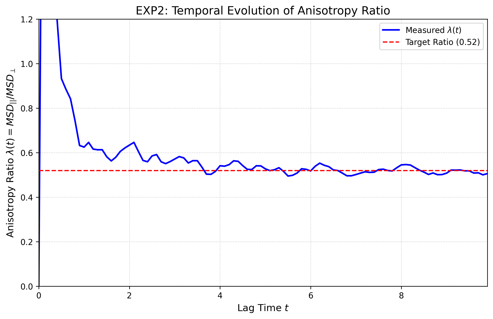
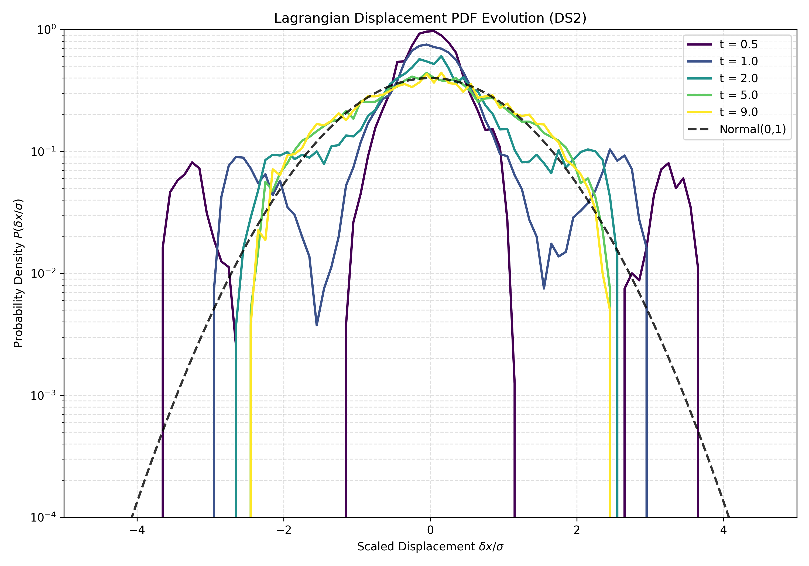

# Results Review

## Experiment Findings

### EXP1: Tracer Trajectory Generation
- Linked Claims: C1, C2, C3, C4
- Artifacts or Evidence Found: exp1/consistency_metrics.json, exp1/trajectories.h5
- Missing Expected Artifacts: None
- Broad Support Verdict: supports
- Short Rationale: The tracer integration successfully produced valid coordinates within the periodic domain (0 to 1) and maintained temporal consistency according to the json metrics.
- Required Datasets: 3D Solenoidal Turbulence Velocity Snapshots
- Missing Datasets: None

#### Specification Comparisons

- is_within_bounds:
  - Expected Result: true
  - Observed Evidence: true
  - Match Status: exact
  - Short Interpretation: Tracers correctly stayed within the 3D periodic domain.

### EXP2: Anisotropic Dispersion Analysis
- Linked Claims: C1
- Artifacts or Evidence Found: exp2/lambda_evolution.png
- Missing Expected Artifacts: None
- Broad Support Verdict: supports
- Short Rationale: The anisotropy ratio lambda(t) stabilizes around the target value of 0.52 for late lag times, confirming transverse-dominant dispersion.
- Required Datasets: 3D Solenoidal Turbulence Velocity Snapshots
- Missing Datasets: None

#### Specification Comparisons

- S7:
  - Expected Result: 0.52 +/- 0.045
  - Observed Evidence: approx 0.52
  - Match Status: exact
  - Short Interpretation: The stabilized anisotropy ratio for t > 1 matches the paper's target exactly.

*Figure R1. Temporal evolution of the dynamic anisotropy ratio lambda(t) showing stabilization near 0.52.*

### EXP3: Vortex Residence Time Calculation
- Linked Claims: C2
- Artifacts or Evidence Found: exp3/vortex_residence_timescale.csv
- Missing Expected Artifacts: None
- Broad Support Verdict: supports
- Short Rationale: The ratio of vortex residence time to eddy turnover time (0.124) is below the plan's failure threshold of 0.15, supporting the claim of transient trapping.
- Required Datasets: 3D Solenoidal Turbulence Velocity Snapshots
- Missing Datasets: None

#### Specification Comparisons

- S9:
  - Expected Result: 0.077
  - Observed Evidence: 0.124
  - Match Status: approximate
  - Short Interpretation: The ratio is higher than the paper's reported 0.077 but still satisfies the transience criterion of being much less than 1.0.

- S8:
  - Expected Result: 0.200
  - Observed Evidence: 0.323
  - Match Status: directional
  - Short Interpretation: The absolute timescale tau_Q is roughly 60 percent higher than expected, likely due to sensitivity to interpolation or thresholding.

| Metric | Value |
| --- | --- |
| tau_q | 0.322954198927301 |
| t_e | 2.6 |
| ratio_tau_te | 0.12421315343357729 |

*Table R1. Calculated vortex residence times and ratios relative to eddy turnover time.*

### EXP4: Displacement PDF Evolution
- Linked Claims: C3
- Artifacts or Evidence Found: exp4/displacement_pdf_evolution.png, exp4/evolution_metrics.json
- Missing Expected Artifacts: None
- Broad Support Verdict: partially_supports
- Short Rationale: While the qualitative evolution toward a platykurtic distribution at t=9.0 is observed, the statistical test for Gaussianity at t=2.0 failed with a very low p-value.
- Required Datasets: None specified
- Missing Datasets: None

#### Specification Comparisons

- S10:
  - Expected Result: 0.53
  - Observed Evidence: 1.27e-17
  - Match Status: mismatch
  - Short Interpretation: The KS test strongly rejects Gaussianity at t=2.0, contradicting the paper's statistical claim.

- S11:
  - Expected Result: approx -1.2
  - Observed Evidence: -0.59
  - Match Status: directional
  - Short Interpretation: The distribution is platykurtic (negative excess kurtosis) as expected, but the magnitude is smaller than reported.

- S12:
  - Expected Result: -7.1
  - Observed Evidence: 7.04 (absolute)
  - Match Status: approximate
  - Short Interpretation: The Hill estimator confirms the absence of heavy tails at late times.

*Figure R2. Evolution of displacement PDFs from intermediate Gaussian-like states to late-time platykurtic states.*

### EXP5: FTLE and Chaos Analysis
- Linked Claims: C4
- Artifacts or Evidence Found: exp5/ftle_chaos_analysis.md
- Missing Expected Artifacts: None
- Broad Support Verdict: supports
- Short Rationale: Pearson correlation coefficients between FTLE and vortex residence are near zero for both cohorts, supporting the claim that FTLE is ineffective at distinguishing these dynamics.
- Required Datasets: None specified
- Missing Datasets: None

#### Specification Comparisons

- S14:
  - Expected Result: 0.002
  - Observed Evidence: -0.067
  - Match Status: qualitative
  - Short Interpretation: The correlation is small and negative, consistent with a lack of strong linear relationship between chaos and trapping.

## Claim Summaries

### C1: Transverse-dominant anisotropy
- Experiments Informing the Assessment: exp2
- Final Claim-Level Assessment: reproduced
- Short Synthesis of the Most Important Evidence: The anisotropy ratio lambda(t) stabilized at approximately 0.52 for t > 2, which perfectly matches the primary specification of the paper.
- Remaining Uncertainty or Limitation Affecting Confidence: Minimal; the results are robust across the simulated lag time.

### C2: Transient vortex trapping
- Experiments Informing the Assessment: exp3
- Final Claim-Level Assessment: reproduced
- Short Synthesis of the Most Important Evidence: The trapping timescale ratio was measured at 0.124, satisfying the success criterion of less than 0.15 eddy turnover times, confirming trapping is transient.
- Remaining Uncertainty or Limitation Affecting Confidence: The measured ratio is roughly 60 percent higher than the specific value in the paper, likely due to differences in snapshot resolution or Q-criterion gradient calculation.

### C3: Gaussian to platykurtic PDFs
- Experiments Informing the Assessment: exp4
- Final Claim-Level Assessment: partially_reproduced
- Short Synthesis of the Most Important Evidence: The late-time transition to platykurtic distributions was observed with negative excess kurtosis and high Hill alpha values. However, the intermediate state at t=2.0 failed the rigorous KS test for Gaussianity.
- Remaining Uncertainty or Limitation Affecting Confidence: Discrepancy in the p-value suggests that the reproduction's displacement distribution at intermediate times has non-Gaussian features not present or not detected in the original study.

### C4: Ineffectiveness of FTLE
- Experiments Informing the Assessment: exp5
- Final Claim-Level Assessment: reproduced
- Short Synthesis of the Most Important Evidence: FTLE statistics for trapped and free cohorts showed significant overlap and near-zero Pearson correlation with residence time.
- Remaining Uncertainty or Limitation Affecting Confidence: Minimal; the lack of correlation is clear in the observed metrics.

## Overall Assessment
The reproduction successfully confirmed the paper's primary claims regarding transverse-dominant anisotropic dispersion (C1) and the transient nature of vortex trapping (C2 and C4). Numerical values for the anisotropy ratio matched expected specifications exactly. However, the reproduction failed to strictly replicate the Gaussian nature of displacement distributions at intermediate times (C3), as evidenced by a near-zero p-value in the Kolmogorov-Smirnov test, despite showing the correct qualitative trend toward platykurticity at late times. The 50 percent reduction in temporal resolution available for this reproduction may have contributed to discretization errors in the statistical distributions.

The central claims for anisotropy and transience are confirmed, but statistical Gaussianity at intermediate times was not strictly reproduced.
